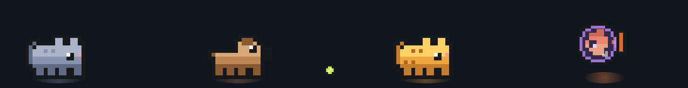

<div align="center">

# strays 🐾

**A tiny team of pets that live at the bottom of your screen and keep you company while Claude Code works.**



Free, open source, and quietly useful.

</div>

---

They wander around above your other windows. When Claude is thinking, they're
busy. When Claude needs you, they hop up and down until you look. When it's all
done, there's confetti.

They're strays because that's what they are twice over: a *stray pointer* is a
bug, and a stray is something you take in. Each one is a bug you have personally
met. None of them can be fixed. That's fine — they're not here to be fixed.

## Meet the team

|     | who | what they're like |
| --- | --- | --- |
| 🐈‍⬛ | **Segfault** | A cat. Everything's fine, everything's fine, then he crashes through something for no reason and reappears across the room like nothing happened. |
| 🐕 | **Grep** | A dog. Finds everything, including the things you didn't ask him to find. He has the ball. There is only one ball. |
| 🐈 | **Mutex** | Also a cat. Two cats cannot pass each other, so when he meets Segfault they both freeze until one of them gives up. Otherwise: asleep. |
| 🐠 | **Heisenbug** | A fish in a little space helmet. Only misbehaves when you're not looking. She also quietly counts what today has cost you, and will mention it. |

Want a fifth? [Draw one.](#make-your-own)

## What they actually do

- **One pet per session.** Three windows of Claude open, three pets out. Only
  sessions that are actually live get one — a conversation you finished with
  hands its pet back.
- **Each pet is labelled** with the name of the session it's carrying, so you can
  tell four of them apart at a glance. A small badge shows thinking, working,
  waiting on you, resting, or done. (Turn the names off in the tray if you'd
  rather not.)
- **Point at a pet for the details** — which checkout it's in, what it's doing.
  The label grows a line rather than covering anything.
- **Each pet talks in its own colour**, so you know who said it without looking.
- **They nudge you** when Claude is stuck waiting for an answer.
- **Click a pet to go to it.** You land in that pet's conversation, not just
  somewhere in the app — and if you're working in a split layout, clicking won't
  tear it down to a single session.
- **Pick one up and put it somewhere else.** Drag a pet along the lane and it
  squirms in your hand like any animal that would rather not be held — the cats
  twist, Grep swings, Heisenbug just vibrates. Let go and it drops back to the
  floor. Dragging never opens the conversation; a click is a press that stays
  put.
- **Say yes without switching windows.** When Claude asks permission for
  something, a little card pops up over the pets. Click Allow and carry on.
- **Heisenbug keeps the receipts.** Hover her for today's tokens and roughly
  what they cost.

Everything happens on your own machine. Nothing is sent anywhere.

## Get them

One command, same on macOS, Windows and Linux. You need
[Node.js](https://nodejs.org) 18 or newer; nothing else.

```bash
npx claude-strays
```

That's it — the pets come out. A 🐾 appears in your menu bar (macOS) or system
tray (Windows, Linux), and that's where everything lives; see
[the tray](#the-tray) below.

To keep the command around instead of fetching it each time:

```bash
npm install -g claude-strays
strays              # start them
strays stop         # send them home
strays --help       # everything else
```

Yes, the package is `claude-strays` and the command is `strays`. npm won't hand
out `strays` — it's too close to an existing package called `stres` — but the
thing you type is unaffected.

<details>
<summary><b>Or from the source</b> — if you'd rather read it first</summary>

```bash
git clone https://github.com/tisu19021997/strays
cd strays
npm install
npm start
```

`npm test` runs the suite. Everything else is in
[docs/development.md](docs/development.md).

</details>

<details>
<summary><b>Keeping them around</b> — starting on login</summary>

Nothing runs in the background unless you start it, and there's no installer.

- **macOS** — System Settings → General → Login Items → **+**, and add a script
  containing `strays`.
- **Windows** — press `Win+R`, type `shell:startup`, and drop in a shortcut to
  `strays`.
- **Linux** — add `strays` to your desktop environment's autostart.

</details>


**Or put them on any web page**, with one line — no Electron, no install:

```html
<script src="strays.js" data-auto></script>
```

### Does it work on my machine?

The engine and the session watcher are plain Node and vanilla canvas, so they
run anywhere. Two things reach into the operating system, and those are not
everywhere yet:

| | macOS | Windows | Linux |
| --- | --- | --- | --- |
| The pets, the lane, session states | ✅ | ✅ | ✅ |
| Session names, badges, token and cost counter | ✅ | ✅ | ✅ |
| Hover a pet for details | ✅ | ✅ | ❌ |
| Pick a pet up and drag it | ✅ | ✅ | ❌ |
| Allow / Deny cards | ✅ | ✅ | ❌ |
| Click a pet to jump to its session | ✅ | ❌ | ❌ |

**Jumping** has to find and focus the window a session is running in, which is
done with AppleScript and the Claude desktop app's own records. Elsewhere a
click does nothing rather than guessing wrong.

**Anything you point at** depends on making a click-through window selectively
catch the pointer, which Electron supports on macOS and Windows but not on
Linux. So on Linux the pets are a display: they show you what's happening, but
the cards can't be clicked.

macOS is what gets exercised daily, and it's the only platform these have been
run on end to end. The Windows paths through the permission rules, the settings
loader and the tray have been fixed and unit-tested, but not yet run on a real
Windows machine — if something's off there, an issue saying what you saw is
genuinely useful.

## The tray

Everything the pets do is switchable, from the 🐾 in your menu bar or system
tray:

| | what it does |
| --- | --- |
| **Follow Claude Code sessions** | Off, and the team just hangs out — no session states, no badges. |
| **Name the session on each pet** | Off leaves the state badge but drops the name. |
| **Heisenbug wanders off when you leave** | She teleports across the lane once you've been away from the keyboard a while. Off means she stays put. |
| **Clicking a pet** | Whether landing on a session may rearrange your panes — see below. |
| **Command approvals** | Turns the Allow / Deny cards on, once the hooks are installed. |
| **Party mode** / **Celebrate** | Hats, and confetti on demand. |
| **Pause pets** | Hides the lane without quitting. |

### Say yes without switching windows

When Claude Code is about to ask your permission for something, a card can rise
above the pets with **Allow** and **Deny** on it.

```bash
strays hooks      # installs the hooks into ~/.claude/settings.json
                  # (it backs the file up first; `strays unhook` removes them)
```

Then switch it on in the tray, and restart any Claude Code sessions you already
have open — hooks are read when a session starts.

The overlay only raises a card when Claude Code would really have stopped to
ask. If you work in `auto` mode you will essentially never see one, and that is
the feature working. [The full rules are here.](docs/approvals.md)

### Clicking a pet

A click takes you to that pet's conversation. If you work with several sessions
tiled side by side, the default (**Keep my layout when it can**) avoids
rearranging your panes to get you there — it only navigates when the session
isn't already in front of you. **Never rearrange panes** guarantees it, and
**Always open the conversation** is the plainest behaviour.

## Make your own

Run `strays editor` (or open `editor.html`), draw a creature on the pixel grid — or drop in a PNG and let
it be squashed into pixels for you — give it a name and a few things to say, and
hit **adopt**. It joins the team.

More in [docs/custom-pets.md](docs/custom-pets.md).

## Free, and open source

All of it. There is no paid tier, no accounts, no telemetry, nothing to unlock.
The "pro" version is just the one where you drew your own pet.

strays owes its existence to [Crew Deskmates](https://crew-deskmates.vercel.app),
a lovely paid desk-pet app that got there first and did it beautifully. If you
want something polished and supported by people whose job it is to support it,
buy theirs — it's good. This one exists because some of us wanted the same idea
wired into Claude Code, and because a present you can read the source of is a
better present.

It started as a birthday gift for Claude. It seemed unfair to keep it.

## When something looks wrong

| what you see | what it usually is |
| --- | --- |
| **Two of every pet** | Two overlays were running. Newer builds refuse to start a second one; `strays stop` then `strays`. |
| **No pets at all** | Nothing is bound and the lane is idle, or the overlay isn't running. Run `strays` again, and `STRAYS_DEBUG=1 strays` will say what it's seeing. |
| **Pets but no names** | Either names are off in the tray, or those pets have no session — an unnamed pet is one that isn't carrying anything. |
| **No Allow / Deny cards** | Expected in `auto` mode. Otherwise check `~/.strays/gate.log`, which records a line and a reason for every call. |
| **A pet for a session I finished** | It keeps its pet for a while after the turn ends, quietly, then hands it back. |
| **Shadows on the floor but no pets** | The lane froze mid-frame. `strays restart` brings them back; if it happens again, an issue with roughly how long it had been running is genuinely useful. |

`STRAYS_DEBUG=1 strays` logs session states, token usage, presence and
approval traffic.

## Documentation

- [Allow / Deny cards](docs/approvals.md) — how the permission prompts work
- [Designing your own pet](docs/custom-pets.md) — the pixel format
- [Development](docs/development.md) — layout, tests, and what will bite you

Everything the app reads is local: transcript timestamps and the last line of
each file under `~/.claude/projects`, and the Claude desktop app's own session
records. Nothing is sent anywhere, and there is no telemetry.

## License

MIT. The pets remain unfixable.
